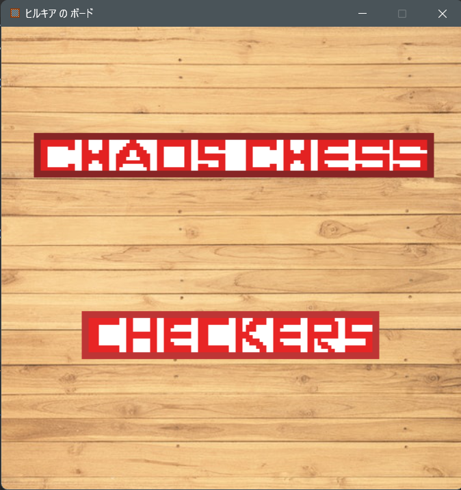
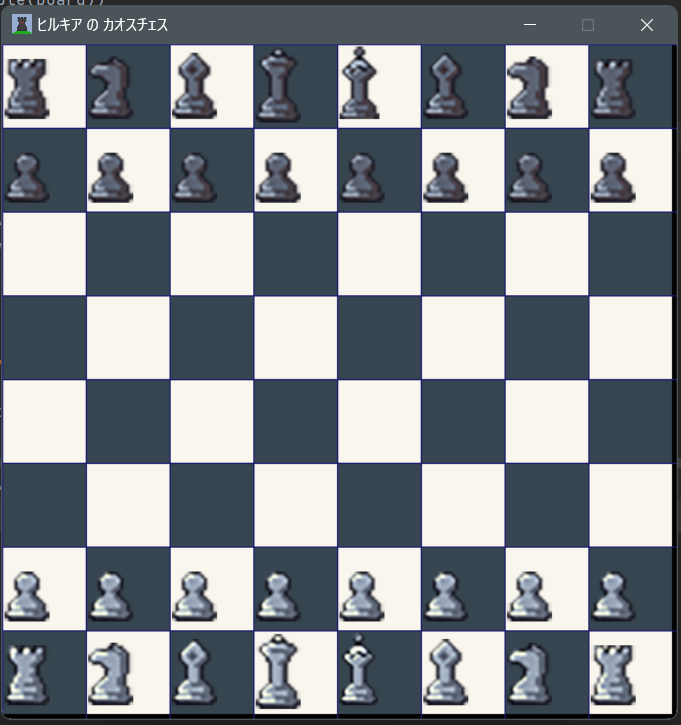
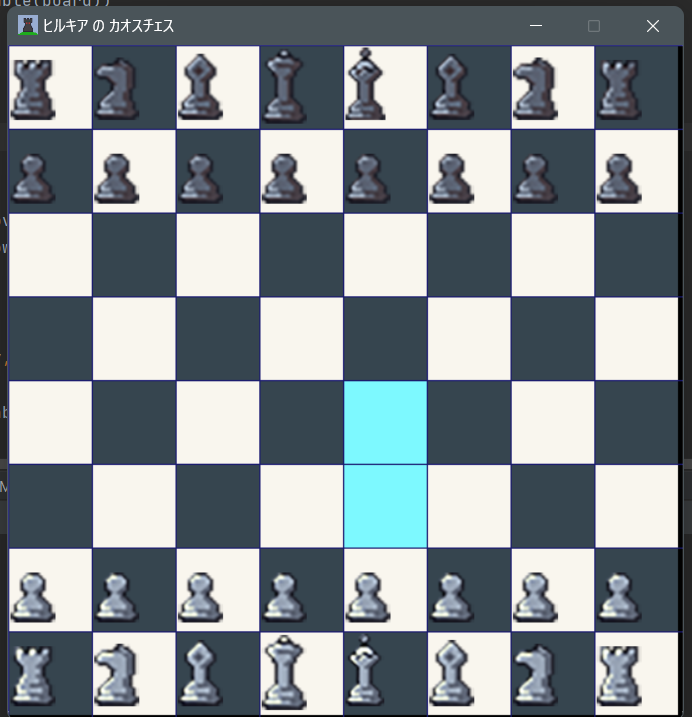

by : Hilkia Kennan Latjandu
NIM : 2602174485
class : L1BC
# source of code and information:
## start and choice
### images, code and info(some image i made)
- https://www.pexels.com/photo/brown-wooden-parquet-flooring-129731/
- https://www.youtube.com/watch?v=f29ZOu4rXlM
- https://chat.openai.com/chat/fde86d00-eb1b-47b7-b2d3-784a2d459b43
- https://www.youtube.com/watch?v=G8MYGDf_9ho
- https://github.com/russs123/pygame_tutorials/tree/main/Button
- https://www.pixilart.com/art/ken-start-btn-sr29ec8e532bd8c
- https://www.pixilart.com/art/ken-checkers-sr27782c5b1ec20
- https://www.pixilart.com/art/ken-chaos-chess-sr29e783fb89824
## chess
### codes and information
- https://levelup.gitconnected.com/chess-python-ca4532c7f5a4
- https://chat.openai.com/chat/fde86d00-eb1b-47b7-b2d3-784a2d459b43
- https://www.thepythoncode.com/article/make-a-chess-game-using-pygame-in-python
### images
- https://pixabay.com/images/search/wood%20texture/ ---
- https://dani-maccari.itch.io/pixel-chess?download
#### logo (i made)
- https://www.pixilart.com/art/ken-sr2ccd205921071
## checkers
### code and information
- https://github.com/techwithtim/Python-Checkers
- https://www.youtube.com/watch?v=vnd3RfeG3NM
- https://www.youtube.com/watch?v=LSYj8GZMjWY
- https://www.youtube.com/watch?v=_kOXGzkbnps
### images and logo (i made)
- https://www.pixilart.com/art/ken-crown-sr286247ae4fe22
- https://www.pixilart.com/art/ken-checkers-sr22d4489b2b3b4
- https://www.pixilart.com/art/ken-chess-board-sr2c7e9d4b86a42

# Requirements
- download pygame
-------------------------------------------------------------
# Documentation
by : Hilkia Kennan Latjandu
NIM : 2602174485
class : L1BC
## Brief Description
my name is Hilkia Kennan Latjandu my NIM is 2602174485, i am making this app/repository for as my final project for algorithm and programing.
the app that i have made is basically a collection of boardgames but at this time i have only been able to put in checkers and chaos chess (it is like chess but no checks and checkmates
and you win by taking the oponents king you can use anything to do so you can even use king to eat the opponents king). all these games are 2 person board games.
## Use-Case Diagram

users will be in start page, then when press start will become choice page where they can choose what to play, either chaos chess or checkers
. then they will be able to move pieces/play the games and find out who wins.
## Activity Diagram

- 1 of 2 user open game
- system makes and display the start page
- 1 of 2 user press start button in start page
- system makes and display the choice page
- 1 of 2 user presses chaos chess / checkers
- system makes , displays and starts the game
- 2 users play the game
- game ends and show who won white/black (chaos chess) or red/white (checkers)
## Class Diagram
### button

### chess

### chekers

## Modules
- i used pygame which is a cross-platform set of Python modules designed for writing video games. 
It includes computer graphics and sound libraries designed to be used with the Python programming language.
## Essential Algorithm
- the button class to connect the pygame windows
- import subprocess so capable of opening other .py 
- def grid/make board to make sure the location of pieces are correct and make a proper chess board
- def code for piece movement on the board important if not we can't play the game
- def winner to make sure the game has an end and a winner between the 2 players
to be fair most of the code used are important because missing 1 might make game crash especially chaos chess and checkers
## screenshot
### start page

### choice page

### chaos chess page

### checkers page

## lessons learned/reflection
i have looked over 20+ codes in total from many sources (the sources above are the ones i remembered to copy link/i copied some code) to do this app and what i have learned is :

pygame is an incredibly complex library, chess is a complicated and confusing game to code with multiple ways to do it
and there is a very high chance that it does not run properly, import chess is very useful when used to code chess but confusing and very limiting, but
without it the code is extremely long, buttons between python code are pretty problematic. 

the video demo link is : https://drive.google.com/drive/u/0/folders/1OgNU345I1_zAJMaqQjdewFo1Nn_Z8nZW
